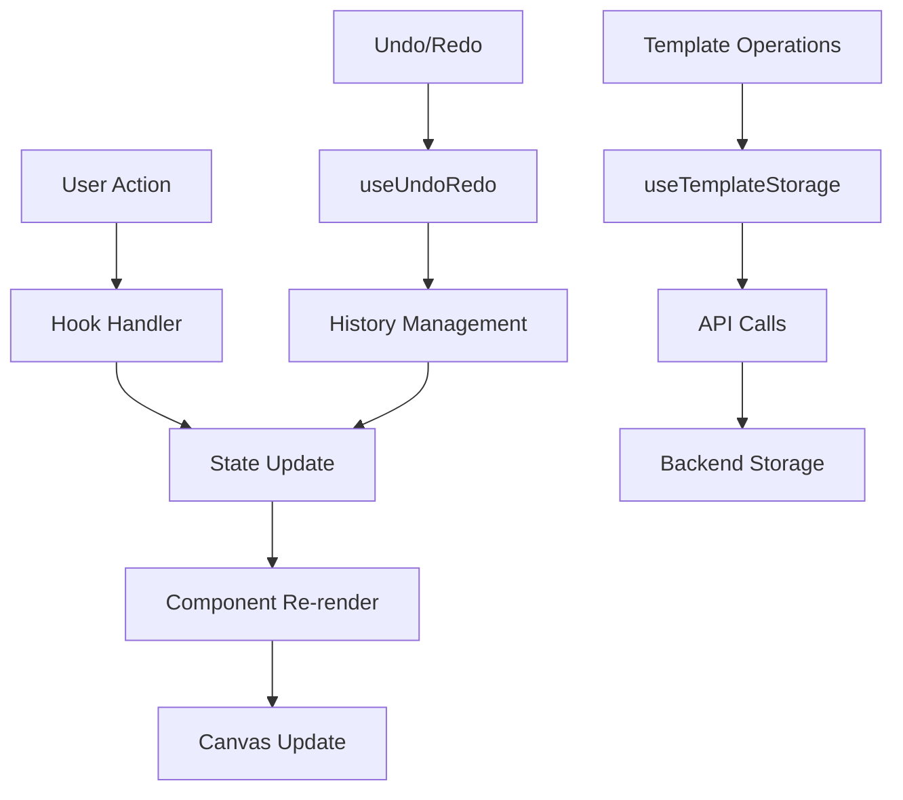

# Design Document

## Overview

O Editor de Layout Profissional será um componente React integrado que substitui completamente o editor externo atual. Inspirado no FastReport, oferecerá funcionalidades completas de edição visual com interface moderna, drag-and-drop, zoom, e todas as ferramentas necessárias para criar templates profissionais de relatórios.

A arquitetura seguirá o padrão de componentes React com estado gerenciado via hooks, garantindo performance e manutenibilidade. O editor será modal full-screen integrado ao sistema principal, mantendo consistência visual e sessão de autenticação.

## Architecture

### Component Architecture

```
EditorLayoutProfissional/
├── components/
│   ├── EditorCanvas/
│   │   ├── Canvas.tsx              # Área principal de edição
│   │   ├── CanvasElement.tsx       # Elemento individual no canvas
│   │   ├── SelectionHandles.tsx    # Alças de redimensionamento
│   │   └── AlignmentGuides.tsx     # Guias de alinhamento
│   ├── Toolbars/
│   │   ├── MainToolbar.tsx         # Barra principal (salvar, zoom, etc.)
│   │   ├── ElementPalette.tsx      # Paleta de elementos
│   │   └── PropertiesPanel.tsx     # Painel de propriedades
│   ├── Modals/
│   │   ├── SaveTemplateModal.tsx   # Modal para salvar
│   │   ├── LoadTemplateModal.tsx   # Modal para carregar
│   │   └── ExportModal.tsx         # Modal para exportar
│   └── Utils/
│       ├── ZoomControls.tsx        # Controles de zoom
│       └── UndoRedoControls.tsx    # Controles de desfazer/refazer
└── hooks/
    ├── useTemplateEditor.ts        # Estado principal do editor
    ├── useElementSelection.ts      # Gerenciamento de seleção
    ├── useCanvasOperations.ts      # Operações do canvas (zoom, pan)
    ├── useUndoRedo.ts             # Sistema de desfazer/refazer
    └── useTemplateStorage.ts       # Persistência de templates
```

### State Management Architecture

```typescript
interface EditorState {
  // Template data
  template: {
    id: string;
    name: string;
    elements: TemplateElement[];
    globalStyles: GlobalStyles;
    pageSettings: PageSettings;
  };
  
  // Editor state
  selectedElementIds: string[];
  clipboard: TemplateElement[];
  isDragging: boolean;
  isResizing: boolean;
  
  // Canvas state
  zoom: number;
  panOffset: { x: number; y: number };
  canvasSize: { width: number; height: number };
  
  // History
  history: EditorState[];
  historyIndex: number;
  
  // UI state
  showGrid: boolean;
  showRulers: boolean;
  snapToGrid: boolean;
}
```

### Data Flow Architecture



## Components and Interfaces

### Core Interfaces

```typescript
interface TemplateElement {
  id: string;
  type: ElementType;
  content: string | ImageData | TableData;
  position: { x: number; y: number };
  size: { width: number; height: number };
  styles: ElementStyles;
  locked: boolean;
  visible: boolean;
  zIndex: number;
}

interface ElementStyles {
  // Typography
  fontFamily?: string;
  fontSize?: number;
  fontWeight?: 'normal' | 'bold';
  fontStyle?: 'normal' | 'italic';
  textDecoration?: 'none' | 'underline';
  color?: string;
  textAlign?: 'left' | 'center' | 'right' | 'justify';
  lineHeight?: number;
  
  // Layout
  padding?: Spacing;
  margin?: Spacing;
  border?: BorderStyle;
  borderRadius?: number;
  backgroundColor?: string;
  
  // Advanced
  opacity?: number;
  rotation?: number;
  shadow?: ShadowStyle;
}

interface PageSettings {
  size: 'A4' | 'A3' | 'Letter' | 'Legal' | 'Custom';
  orientation: 'portrait' | 'landscape';
  margins: { top: number; right: number; bottom: number; left: number };
  backgroundColor: string;
  showMargins: boolean;
}
```

### Main Component Structure

```typescript
const EditorLayoutProfissional: React.FC<EditorProps> = ({
  isOpen,
  onClose,
  templateId,
  onSave
}) => {
  // Hooks
  const editor = useTemplateEditor(templateId);
  const selection = useElementSelection();
  const canvas = useCanvasOperations();
  const undoRedo = useUndoRedo();
  
  return (
    <Modal isOpen={isOpen} onClose={onClose} size="fullscreen">
      <div className="editor-layout">
        <MainToolbar />
        
        <div className="editor-content">
          <ElementPalette />
          
          <div className="canvas-container">
            <ZoomControls />
            <Canvas />
          </div>
          
          <PropertiesPanel />
        </div>
        
        <StatusBar />
      </div>
    </Modal>
  );
};
```

## Data Models

### Template Data Model

```typescript
interface Template {
  id: string;
  name: string;
  description?: string;
  category: string;
  
  // Content
  elements: TemplateElement[];
  globalStyles: GlobalStyles;
  pageSettings: PageSettings;
  
  // Metadata
  createdAt: Date;
  updatedAt: Date;
  createdBy: string;
  version: number;
  
  // Settings
  isPublic: boolean;
  tags: string[];
  thumbnail?: string;
}

interface GlobalStyles {
  fontFamily: string;
  fontSize: number;
  color: string;
  backgroundColor: string;
  lineHeight: number;
}
```

### Element Types

```typescript
type ElementType = 
  | 'text'
  | 'heading'
  | 'image'
  | 'table'
  | 'chart'
  | 'line'
  | 'rectangle'
  | 'circle'
  | 'signature'
  | 'barcode'
  | 'qrcode';

interface TextElement extends TemplateElement {
  type: 'text' | 'heading';
  content: string;
  styles: TextStyles;
}

interface ImageElement extends TemplateElement {
  type: 'image';
  content: {
    src: string;
    alt: string;
    originalSize: { width: number; height: number };
  };
  styles: ImageStyles;
}

interface TableElement extends TemplateElement {
  type: 'table';
  content: {
    rows: number;
    columns: number;
    data: string[][];
    headers?: string[];
  };
  styles: TableStyles;
}
```

## Error Handling

### Error Boundaries

```typescript
class EditorErrorBoundary extends React.Component {
  state = { hasError: false, error: null };
  
  static getDerivedStateFromError(error: Error) {
    return { hasError: true, error };
  }
  
  componentDidCatch(error: Error, errorInfo: React.ErrorInfo) {
    console.error('Editor Error:', error, errorInfo);
    // Log to monitoring service
  }
  
  render() {
    if (this.state.hasError) {
      return <EditorErrorFallback onRetry={this.handleRetry} />;
    }
    
    return this.props.children;
  }
}
```

### Error Types and Handling

```typescript
enum EditorErrorType {
  TEMPLATE_LOAD_FAILED = 'TEMPLATE_LOAD_FAILED',
  TEMPLATE_SAVE_FAILED = 'TEMPLATE_SAVE_FAILED',
  EXPORT_FAILED = 'EXPORT_FAILED',
  INVALID_ELEMENT_DATA = 'INVALID_ELEMENT_DATA',
  CANVAS_RENDER_ERROR = 'CANVAS_RENDER_ERROR'
}

interface EditorError {
  type: EditorErrorType;
  message: string;
  details?: any;
  recoverable: boolean;
}

const useErrorHandler = () => {
  const [errors, setErrors] = useState<EditorError[]>([]);
  
  const handleError = (error: EditorError) => {
    setErrors(prev => [...prev, error]);
    
    // Show user notification
    if (error.recoverable) {
      showWarningToast(error.message);
    } else {
      showErrorToast(error.message);
    }
  };
  
  return { errors, handleError };
};
```

## Testing Strategy

### Unit Testing

```typescript
// Component Tests
describe('EditorCanvas', () => {
  it('should render elements correctly', () => {
    const elements = [mockTextElement, mockImageElement];
    render(<EditorCanvas elements={elements} />);
    
    expect(screen.getByText(mockTextElement.content)).toBeInTheDocument();
    expect(screen.getByRole('img')).toBeInTheDocument();
  });
  
  it('should handle element selection', () => {
    const onSelect = jest.fn();
    render(<EditorCanvas elements={[mockTextElement]} onElementSelect={onSelect} />);
    
    fireEvent.click(screen.getByText(mockTextElement.content));
    expect(onSelect).toHaveBeenCalledWith(mockTextElement.id);
  });
});

// Hook Tests
describe('useTemplateEditor', () => {
  it('should add element correctly', () => {
    const { result } = renderHook(() => useTemplateEditor());
    
    act(() => {
      result.current.addElement('text', { x: 100, y: 100 });
    });
    
    expect(result.current.template.elements).toHaveLength(1);
    expect(result.current.template.elements[0].type).toBe('text');
  });
});
```

### Integration Testing

```typescript
describe('Editor Integration', () => {
  it('should save and load template correctly', async () => {
    const { user } = setup(<EditorLayoutProfissional isOpen={true} />);
    
    // Add elements
    await user.click(screen.getByText('Texto'));
    await user.click(screen.getByText('Imagem'));
    
    // Save template
    await user.click(screen.getByText('Salvar'));
    await user.type(screen.getByLabelText('Nome do template'), 'Teste');
    await user.click(screen.getByText('Confirmar'));
    
    // Verify save
    expect(mockSaveTemplate).toHaveBeenCalledWith(
      expect.objectContaining({
        name: 'Teste',
        elements: expect.arrayContaining([
          expect.objectContaining({ type: 'text' }),
          expect.objectContaining({ type: 'image' })
        ])
      })
    );
  });
});
```

### E2E Testing

```typescript
describe('Editor E2E', () => {
  it('should create complete template workflow', () => {
    cy.visit('/templates');
    cy.get('[data-testid="new-template"]').click();
    
    // Add elements
    cy.get('[data-testid="element-text"]').click();
    cy.get('[data-testid="canvas"]').click(200, 100);
    
    // Edit text
    cy.get('[data-testid="canvas-element"]').dblclick();
    cy.type('Título do Relatório');
    
    // Format text
    cy.get('[data-testid="bold-button"]').click();
    cy.get('[data-testid="font-size"]').clear().type('24');
    
    // Save template
    cy.get('[data-testid="save-button"]').click();
    cy.get('[data-testid="template-name"]').type('Relatório Padrão');
    cy.get('[data-testid="save-confirm"]').click();
    
    // Verify success
    cy.get('[data-testid="success-message"]').should('be.visible');
  });
});
```

### Performance Testing

```typescript
describe('Editor Performance', () => {
  it('should handle large templates efficiently', () => {
    const largeTemplate = createTemplateWithElements(1000);
    
    const startTime = performance.now();
    render(<EditorCanvas elements={largeTemplate.elements} />);
    const renderTime = performance.now() - startTime;
    
    expect(renderTime).toBeLessThan(1000); // Should render in < 1s
  });
  
  it('should maintain 60fps during interactions', () => {
    const { container } = render(<EditorCanvas elements={mockElements} />);
    
    // Simulate drag operation
    const element = container.querySelector('[data-element-id]');
    const fps = measureFPS(() => {
      simulateDrag(element, { x: 0, y: 0 }, { x: 100, y: 100 });
    });
    
    expect(fps).toBeGreaterThan(55); // Allow some margin for 60fps
  });
});
```

## Implementation Phases

### Phase 1: Core Infrastructure (Week 1)
- Basic component structure
- State management hooks
- Canvas rendering
- Element selection system

### Phase 2: Element Management (Week 2)
- Element palette
- Add/remove elements
- Basic properties panel
- Text editing

### Phase 3: Advanced Editing (Week 3)
- Drag and drop
- Resize handles
- Formatting controls
- Alignment guides

### Phase 4: Canvas Features (Week 4)
- Zoom functionality
- Grid and rulers
- Snap to grid
- Multi-selection

### Phase 5: Template Management (Week 5)
- Save/load templates
- Template library
- Export functionality
- Undo/redo system

### Phase 6: Polish and Optimization (Week 6)
- Performance optimization
- Error handling
- Accessibility
- Testing and bug fixes