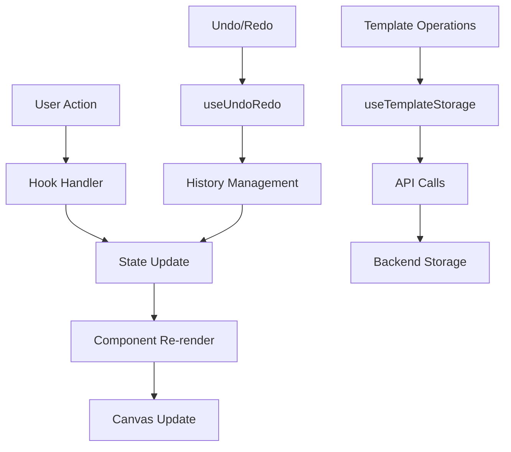

# Design Document

## Overview

O Editor de Layout Profissional será um componente React integrado que substitui completamente o editor externo atual. Inspirado no FastReport, oferecerá funcionalidades completas de edição visual com interface moderna, drag-and-drop, zoom, e todas as ferramentas necessárias para criar templates profissionais de relatórios.

A arquitetura seguirá o padrão de componentes React com estado gerenciado via hooks, garantindo performance e manutenibilidade. O editor será modal full-screen integrado ao sistema principal, mantendo consistência visual e sessão de autenticação.

**Principais melhorias desta versão:**
- Sistema de configuração de página com margens e validação de limites
- Suporte a múltiplas páginas para laudos extensos (40+ páginas)
- Upload de imagem de fundo que se repete em todas as páginas
- Correção completa dos sistemas de carregamento, salvamento, preview e exportação
- Implementação funcional de régua e grade com snap
- Interface limpa sem elementos visuais desnecessários
- Sistema robusto de tratamento de erros com posicionamento correto

## Architecture

### Component Architecture

```
EditorLayoutProfissional/
├── components/
│   ├── EditorCanvas/
│   │   ├── Canvas.tsx              # Área principal de edição com múltiplas páginas
│   │   ├── CanvasElement.tsx       # Elemento individual no canvas (interface limpa)
│   │   ├── SelectionHandles.tsx    # Alças de redimensionamento (sem ícones extras)
│   │   ├── AlignmentGuides.tsx     # Guias de alinhamento
│   │   ├── PageMargins.tsx         # Visualização das margens da página
│   │   ├── GridOverlay.tsx         # Grade funcional com snap
│   │   ├── RulerOverlay.tsx        # Réguas horizontal e vertical
│   │   └── BackgroundImage.tsx     # Imagem de fundo repetida
│   ├── Toolbars/
│   │   ├── MainToolbar.tsx         # Barra principal (salvar, zoom, régua, grade)
│   │   ├── ElementPalette.tsx      # Paleta de elementos
│   │   ├── PropertiesPanel.tsx     # Painel de propriedades
│   │   └── PageNavigation.tsx      # Navegação entre páginas
│   ├── Modals/
│   │   ├── SaveTemplateModal.tsx   # Modal para salvar (com tratamento de erro)
│   │   ├── LoadTemplateModal.tsx   # Modal para carregar (com tratamento de erro)
│   │   ├── ExportModal.tsx         # Modal para exportar (com validação)
│   │   ├── PreviewModal.tsx        # Modal de preview funcional
│   │   └── PageSettingsModal.tsx   # Configurações de página e margens
│   ├── Utils/
│   │   ├── ZoomControls.tsx        # Controles de zoom
│   │   ├── UndoRedoControls.tsx    # Controles de desfazer/refazer
│   │   └── ErrorNotification.tsx   # Sistema de notificação de erros
│   └── ErrorBoundary/
│       └── EditorErrorBoundary.tsx # Tratamento de erros do editor
└── hooks/
    ├── useTemplateEditor.ts        # Estado principal do editor
    ├── useElementSelection.ts      # Gerenciamento de seleção
    ├── useCanvasOperations.ts      # Operações do canvas (zoom, pan)
    ├── useUndoRedo.ts             # Sistema de desfazer/refazer
    ├── useTemplateStorage.ts       # Persistência de templates (com retry)
    ├── usePageManagement.ts        # Gerenciamento de múltiplas páginas
    ├── usePageSettings.ts          # Configurações de página e margens
    └── useErrorHandler.ts          # Tratamento centralizado de erros
```

### State Management Architecture

```typescript
interface EditorState {
  // Template data
  template: {
    id: string;
    name: string;
    pages: TemplatePage[];
    globalStyles: GlobalStyles;
    pageSettings: PageSettings;
    backgroundImage?: BackgroundImageSettings;
  };
  
  // Page management
  currentPageIndex: number;
  totalPages: number;
  
  // Editor state
  selectedElementIds: string[];
  clipboard: TemplateElement[];
  isDragging: boolean;
  isResizing: boolean;
  
  // Canvas state
  zoom: number;
  panOffset: { x: number; y: number };
  canvasSize: { width: number; height: number };
  
  // History
  history: EditorState[];
  historyIndex: number;
  
  // UI state
  showGrid: boolean;
  showRulers: boolean;
  snapToGrid: boolean;
  gridSize: number;
  showMargins: boolean;
  
  // Error handling
  errors: EditorError[];
  isLoading: boolean;
  lastSaveTime?: Date;
}

interface TemplatePage {
  id: string;
  elements: TemplateElement[];
  pageNumber: number;
}

interface BackgroundImageSettings {
  url: string;
  repeat: 'repeat' | 'no-repeat' | 'repeat-x' | 'repeat-y';
  opacity: number;
  position: 'center' | 'top-left' | 'top-right' | 'bottom-left' | 'bottom-right';
}

interface PageSettings {
  size: 'A4' | 'A3' | 'Letter' | 'Legal' | 'Custom';
  orientation: 'portrait' | 'landscape';
  margins: { top: number; right: number; bottom: number; left: number };
  backgroundColor: string;
  customSize?: { width: number; height: number };
}
```

### Data Flow Architecture



## Components and Interfaces

### Core Interfaces

```typescript
interface TemplateElement {
  id: string;
  type: ElementType;
  content: string | ImageData | TableData;
  position: { x: number; y: number };
  size: { width: number; height: number };
  styles: ElementStyles;
  locked: boolean;
  visible: boolean;
  zIndex: number;
  pageId: string; // Associação com página específica
}

interface ElementStyles {
  // Typography
  fontFamily?: string;
  fontSize?: number;
  fontWeight?: 'normal' | 'bold';
  fontStyle?: 'normal' | 'italic';
  textDecoration?: 'none' | 'underline';
  color?: string;
  textAlign?: 'left' | 'center' | 'right' | 'justify';
  lineHeight?: number;
  
  // Layout
  padding?: Spacing;
  margin?: Spacing;
  border?: BorderStyle;
  borderRadius?: number;
  backgroundColor?: string;
  
  // Advanced
  opacity?: number;
  rotation?: number;
  shadow?: ShadowStyle;
}

// Validação de limites da página
interface PageBounds {
  minX: number;
  maxX: number;
  minY: number;
  maxY: number;
}

interface MarginConstraints {
  respectMargins: boolean;
  showMarginGuides: boolean;
  snapToMargins: boolean;
}

// Sistema de grid e régua
interface GridSettings {
  enabled: boolean;
  size: number; // em pixels
  color: string;
  opacity: number;
  snapEnabled: boolean;
  snapTolerance: number; // pixels
}

interface RulerSettings {
  enabled: boolean;
  unit: 'px' | 'mm' | 'cm' | 'in';
  color: string;
  backgroundColor: string;
}
```

### Main Component Structure

```typescript
const EditorLayoutProfissional: React.FC<EditorProps> = ({
  isOpen,
  onClose,
  templateId,
  onSave
}) => {
  // Hooks
  const editor = useTemplateEditor(templateId);
  const selection = useElementSelection();
  const canvas = useCanvasOperations();
  const undoRedo = useUndoRedo();
  
  return (
    <Modal isOpen={isOpen} onClose={onClose} size="fullscreen">
      <div className="editor-layout">
        <MainToolbar />
        
        <div className="editor-content">
          <ElementPalette />
          
          <div className="canvas-container">
            <ZoomControls />
            <Canvas />
          </div>
          
          <PropertiesPanel />
        </div>
        
        <StatusBar />
      </div>
    </Modal>
  );
};
```

## Data Models

### Template Data Model

```typescript
interface Template {
  id: string;
  name: string;
  description?: string;
  category: string;
  
  // Content
  elements: TemplateElement[];
  globalStyles: GlobalStyles;
  pageSettings: PageSettings;
  
  // Metadata
  createdAt: Date;
  updatedAt: Date;
  createdBy: string;
  version: number;
  
  // Settings
  isPublic: boolean;
  tags: string[];
  thumbnail?: string;
}

interface GlobalStyles {
  fontFamily: string;
  fontSize: number;
  color: string;
  backgroundColor: string;
  lineHeight: number;
}
```

### Element Types

```typescript
type ElementType = 
  | 'text'
  | 'heading'
  | 'image'
  | 'table'
  | 'chart'
  | 'line'
  | 'rectangle'
  | 'circle'
  | 'signature'
  | 'barcode'
  | 'qrcode';

interface TextElement extends TemplateElement {
  type: 'text' | 'heading';
  content: string;
  styles: TextStyles;
}

interface ImageElement extends TemplateElement {
  type: 'image';
  content: {
    src: string;
    alt: string;
    originalSize: { width: number; height: number };
  };
  styles: ImageStyles;
}

interface TableElement extends TemplateElement {
  type: 'table';
  content: {
    rows: number;
    columns: number;
    data: string[][];
    headers?: string[];
  };
  styles: TableStyles;
}
```

## Page Management System

### Multi-Page Architecture

```typescript
const usePageManagement = () => {
  const [pages, setPages] = useState<TemplatePage[]>([]);
  const [currentPageIndex, setCurrentPageIndex] = useState(0);
  
  const addPage = (afterIndex?: number) => {
    const newPage: TemplatePage = {
      id: generateId(),
      elements: [],
      pageNumber: pages.length + 1
    };
    
    const insertIndex = afterIndex !== undefined ? afterIndex + 1 : pages.length;
    const newPages = [...pages];
    newPages.splice(insertIndex, 0, newPage);
    
    // Renumerar páginas
    newPages.forEach((page, index) => {
      page.pageNumber = index + 1;
    });
    
    setPages(newPages);
    setCurrentPageIndex(insertIndex);
  };
  
  const removePage = (pageIndex: number) => {
    if (pages.length <= 1) return; // Manter pelo menos uma página
    
    const newPages = pages.filter((_, index) => index !== pageIndex);
    newPages.forEach((page, index) => {
      page.pageNumber = index + 1;
    });
    
    setPages(newPages);
    
    // Ajustar página atual se necessário
    if (currentPageIndex >= newPages.length) {
      setCurrentPageIndex(newPages.length - 1);
    }
  };
  
  return {
    pages,
    currentPageIndex,
    currentPage: pages[currentPageIndex],
    addPage,
    removePage,
    setCurrentPageIndex,
    totalPages: pages.length
  };
};
```

### Background Image System

```typescript
const useBackgroundImage = () => {
  const [backgroundSettings, setBackgroundSettings] = useState<BackgroundImageSettings | null>(null);
  
  const uploadBackgroundImage = async (file: File) => {
    try {
      const formData = new FormData();
      formData.append('image', file);
      
      const response = await fetch('/api/templates/background-image', {
        method: 'POST',
        body: formData
      });
      
      if (!response.ok) {
        throw new Error('Falha no upload da imagem');
      }
      
      const { url } = await response.json();
      
      setBackgroundSettings({
        url,
        repeat: 'repeat',
        opacity: 0.1,
        position: 'center'
      });
      
      return url;
    } catch (error) {
      throw new Error(`Erro ao fazer upload: ${error.message}`);
    }
  };
  
  const removeBackgroundImage = () => {
    setBackgroundSettings(null);
  };
  
  return {
    backgroundSettings,
    uploadBackgroundImage,
    removeBackgroundImage,
    updateBackgroundSettings: setBackgroundSettings
  };
};
```

## Margin and Bounds Validation

### Position Constraint System

```typescript
const usePositionConstraints = (pageSettings: PageSettings) => {
  const getPageBounds = (): PageBounds => {
    const pageSize = getPageSize(pageSettings.size, pageSettings.orientation);
    const margins = pageSettings.margins;
    
    return {
      minX: margins.left,
      maxX: pageSize.width - margins.right,
      minY: margins.top,
      maxY: pageSize.height - margins.bottom
    };
  };
  
  const validateElementPosition = (
    element: TemplateElement,
    newPosition: { x: number; y: number },
    newSize?: { width: number; height: number }
  ): { x: number; y: number } => {
    const bounds = getPageBounds();
    const size = newSize || element.size;
    
    let { x, y } = newPosition;
    
    // Validar limites horizontais
    if (x < bounds.minX) x = bounds.minX;
    if (x + size.width > bounds.maxX) x = bounds.maxX - size.width;
    
    // Validar limites verticais
    if (y < bounds.minY) y = bounds.minY;
    if (y + size.height > bounds.maxY) y = bounds.maxY - size.height;
    
    return { x, y };
  };
  
  const validateElementSize = (
    element: TemplateElement,
    newSize: { width: number; height: number }
  ): { width: number; height: number } => {
    const bounds = getPageBounds();
    const maxWidth = bounds.maxX - element.position.x;
    const maxHeight = bounds.maxY - element.position.y;
    
    return {
      width: Math.min(newSize.width, maxWidth),
      height: Math.min(newSize.height, maxHeight)
    };
  };
  
  return {
    getPageBounds,
    validateElementPosition,
    validateElementSize
  };
};
```

## Grid and Ruler Implementation

### Grid System

```typescript
const GridOverlay: React.FC<{ settings: GridSettings; zoom: number }> = ({ 
  settings, 
  zoom 
}) => {
  if (!settings.enabled) return null;
  
  const gridSize = settings.size * zoom;
  const canvasSize = getCanvasSize();
  
  const horizontalLines = Math.ceil(canvasSize.height / gridSize);
  const verticalLines = Math.ceil(canvasSize.width / gridSize);
  
  return (
    <svg 
      className="absolute inset-0 pointer-events-none"
      style={{ opacity: settings.opacity }}
    >
      {/* Linhas verticais */}
      {Array.from({ length: verticalLines }, (_, i) => (
        <line
          key={`v-${i}`}
          x1={i * gridSize}
          y1={0}
          x2={i * gridSize}
          y2={canvasSize.height}
          stroke={settings.color}
          strokeWidth={1}
        />
      ))}
      
      {/* Linhas horizontais */}
      {Array.from({ length: horizontalLines }, (_, i) => (
        <line
          key={`h-${i}`}
          x1={0}
          y1={i * gridSize}
          x2={canvasSize.width}
          y2={i * gridSize}
          stroke={settings.color}
          strokeWidth={1}
        />
      ))}
    </svg>
  );
};

const useGridSnap = (gridSettings: GridSettings) => {
  const snapToGrid = (position: { x: number; y: number }): { x: number; y: number } => {
    if (!gridSettings.enabled || !gridSettings.snapEnabled) {
      return position;
    }
    
    const { size, snapTolerance } = gridSettings;
    
    const snappedX = Math.round(position.x / size) * size;
    const snappedY = Math.round(position.y / size) * size;
    
    const deltaX = Math.abs(position.x - snappedX);
    const deltaY = Math.abs(position.y - snappedY);
    
    return {
      x: deltaX <= snapTolerance ? snappedX : position.x,
      y: deltaY <= snapTolerance ? snappedY : position.y
    };
  };
  
  return { snapToGrid };
};
```

### Ruler System

```typescript
const RulerOverlay: React.FC<{ 
  settings: RulerSettings; 
  zoom: number;
  canvasSize: { width: number; height: number };
}> = ({ settings, zoom, canvasSize }) => {
  if (!settings.enabled) return null;
  
  const rulerSize = 20; // pixels
  const tickInterval = getTickInterval(zoom, settings.unit);
  
  return (
    <div className="absolute inset-0 pointer-events-none">
      {/* Régua horizontal */}
      <div 
        className="absolute top-0 left-0 right-0"
        style={{ 
          height: rulerSize,
          backgroundColor: settings.backgroundColor,
          borderBottom: `1px solid ${settings.color}`
        }}
      >
        {generateHorizontalTicks(canvasSize.width, tickInterval, zoom, settings)}
      </div>
      
      {/* Régua vertical */}
      <div 
        className="absolute top-0 left-0 bottom-0"
        style={{ 
          width: rulerSize,
          backgroundColor: settings.backgroundColor,
          borderRight: `1px solid ${settings.color}`
        }}
      >
        {generateVerticalTicks(canvasSize.height, tickInterval, zoom, settings)}
      </div>
    </div>
  );
};
```

## Clean Interface Implementation

### Element Selection Without Visual Clutter

```typescript
const CanvasElement: React.FC<{
  element: TemplateElement;
  isSelected: boolean;
  onSelect: () => void;
}> = ({ element, isSelected, onSelect }) => {
  return (
    <div
      className={`absolute cursor-pointer ${isSelected ? 'selected-element' : ''}`}
      style={{
        left: element.position.x,
        top: element.position.y,
        width: element.size.width,
        height: element.size.height,
        zIndex: element.zIndex
      }}
      onClick={onSelect}
    >
      {/* Conteúdo do elemento sem decorações */}
      <ElementContent element={element} />
      
      {/* Alças de redimensionamento apenas quando selecionado */}
      {isSelected && (
        <SelectionHandles 
          element={element}
          showLabels={false} // Não mostrar nomes
          showIcons={false}  // Não mostrar ícones
        />
      )}
    </div>
  );
};

const SelectionHandles: React.FC<{
  element: TemplateElement;
  showLabels: boolean;
  showIcons: boolean;
}> = ({ element, showLabels, showIcons }) => {
  const handlePositions = [
    { position: 'top-left', cursor: 'nw-resize' },
    { position: 'top-right', cursor: 'ne-resize' },
    { position: 'bottom-left', cursor: 'sw-resize' },
    { position: 'bottom-right', cursor: 'se-resize' },
    { position: 'top-center', cursor: 'n-resize' },
    { position: 'bottom-center', cursor: 's-resize' },
    { position: 'left-center', cursor: 'w-resize' },
    { position: 'right-center', cursor: 'e-resize' }
  ];
  
  return (
    <>
      {/* Borda de seleção */}
      <div className="absolute inset-0 border-2 border-blue-500 pointer-events-none" />
      
      {/* Alças de redimensionamento */}
      {handlePositions.map(({ position, cursor }) => (
        <div
          key={position}
          className={`absolute w-2 h-2 bg-blue-500 border border-white ${getHandlePositionClass(position)}`}
          style={{ cursor }}
          onMouseDown={(e) => handleResizeStart(e, position)}
        />
      ))}
      
      {/* Remover completamente labels e ícones */}
      {/* Não renderizar nomes ou ícones decorativos */}
    </>
  );
};
```

## Error Handling

### Error Boundaries

```typescript
class EditorErrorBoundary extends React.Component {
  state = { hasError: false, error: null };
  
  static getDerivedStateFromError(error: Error) {
    return { hasError: true, error };
  }
  
  componentDidCatch(error: Error, errorInfo: React.ErrorInfo) {
    console.error('Editor Error:', error, errorInfo);
    // Log to monitoring service
  }
  
  render() {
    if (this.state.hasError) {
      return <EditorErrorFallback onRetry={this.handleRetry} />;
    }
    
    return this.props.children;
  }
}
```

### Error Types and Handling

```typescript
enum EditorErrorType {
  TEMPLATE_LOAD_FAILED = 'TEMPLATE_LOAD_FAILED',
  TEMPLATE_SAVE_FAILED = 'TEMPLATE_SAVE_FAILED',
  EXPORT_FAILED = 'EXPORT_FAILED',
  TEMPLATE_NOT_FOUND = 'TEMPLATE_NOT_FOUND',
  PREVIEW_FAILED = 'PREVIEW_FAILED',
  BACKGROUND_UPLOAD_FAILED = 'BACKGROUND_UPLOAD_FAILED',
  INVALID_ELEMENT_DATA = 'INVALID_ELEMENT_DATA',
  CANVAS_RENDER_ERROR = 'CANVAS_RENDER_ERROR',
  NETWORK_ERROR = 'NETWORK_ERROR'
}

interface EditorError {
  type: EditorErrorType;
  message: string;
  details?: any;
  recoverable: boolean;
  timestamp: Date;
  id: string;
}

const useErrorHandler = () => {
  const [errors, setErrors] = useState<EditorError[]>([]);
  
  const handleError = (error: EditorError) => {
    const errorWithId = {
      ...error,
      id: generateId(),
      timestamp: new Date()
    };
    
    setErrors(prev => [...prev, errorWithId]);
    
    // Log para monitoramento
    console.error('Editor Error:', errorWithId);
    
    return errorWithId.id;
  };
  
  const dismissError = (errorId: string) => {
    setErrors(prev => prev.filter(error => error.id !== errorId));
  };
  
  const clearAllErrors = () => {
    setErrors([]);
  };
  
  return { 
    errors, 
    handleError, 
    dismissError, 
    clearAllErrors,
    hasErrors: errors.length > 0
  };
};

// Componente de notificação de erro com posicionamento correto
const ErrorNotification: React.FC<{
  errors: EditorError[];
  onDismiss: (errorId: string) => void;
}> = ({ errors, onDismiss }) => {
  if (errors.length === 0) return null;
  
  return (
    <div className="fixed top-4 right-4 z-50 space-y-2 max-w-md">
      {errors.map(error => (
        <div
          key={error.id}
          className={`
            p-4 rounded-lg shadow-lg border-l-4 bg-white
            ${error.recoverable ? 'border-yellow-500' : 'border-red-500'}
          `}
        >
          <div className="flex items-start justify-between">
            <div className="flex-1">
              <h4 className={`font-medium ${error.recoverable ? 'text-yellow-800' : 'text-red-800'}`}>
                {getErrorTitle(error.type)}
              </h4>
              <p className="mt-1 text-sm text-gray-600">
                {error.message}
              </p>
            </div>
            <button
              onClick={() => onDismiss(error.id)}
              className="ml-4 text-gray-400 hover:text-gray-600"
            >
              <X size={16} />
            </button>
          </div>
        </div>
      ))}
    </div>
  );
};
```

### Robust Template Operations

```typescript
const useTemplateStorage = () => {
  const { handleError } = useErrorHandler();
  const [isLoading, setIsLoading] = useState(false);
  
  const saveTemplate = async (template: Template): Promise<boolean> => {
    setIsLoading(true);
    
    try {
      // Validar template antes de salvar
      validateTemplate(template);
      
      const response = await fetch('/api/templates', {
        method: 'POST',
        headers: {
          'Content-Type': 'application/json',
        },
        body: JSON.stringify(template)
      });
      
      if (!response.ok) {
        const errorData = await response.json();
        throw new Error(errorData.message || 'Falha ao salvar template');
      }
      
      const savedTemplate = await response.json();
      
      // Atualizar estado local
      updateLocalTemplate(savedTemplate);
      
      return true;
    } catch (error) {
      handleError({
        type: EditorErrorType.TEMPLATE_SAVE_FAILED,
        message: `Erro ao salvar template: ${error.message}`,
        details: error,
        recoverable: true
      });
      
      return false;
    } finally {
      setIsLoading(false);
    }
  };
  
  const loadTemplate = async (templateId: string): Promise<Template | null> => {
    setIsLoading(true);
    
    try {
      const response = await fetch(`/api/templates/${templateId}`);
      
      if (!response.ok) {
        if (response.status === 404) {
          throw new Error('Template não encontrado');
        }
        throw new Error('Falha ao carregar template');
      }
      
      const template = await response.json();
      
      // Validar integridade do template
      validateTemplate(template);
      
      return template;
    } catch (error) {
      const errorType = error.message.includes('não encontrado') 
        ? EditorErrorType.TEMPLATE_NOT_FOUND 
        : EditorErrorType.TEMPLATE_LOAD_FAILED;
      
      handleError({
        type: errorType,
        message: error.message,
        details: error,
        recoverable: true
      });
      
      return null;
    } finally {
      setIsLoading(false);
    }
  };
  
  const exportTemplate = async (template: Template, format: 'pdf' | 'png' | 'html'): Promise<string | null> => {
    setIsLoading(true);
    
    try {
      // Validar template antes de exportar
      if (!template.pages || template.pages.length === 0) {
        throw new Error('Template vazio não pode ser exportado');
      }
      
      const response = await fetch('/api/templates/export', {
        method: 'POST',
        headers: {
          'Content-Type': 'application/json',
        },
        body: JSON.stringify({
          template,
          format,
          options: {
            includeBackground: true,
            quality: format === 'png' ? 'high' : undefined
          }
        })
      });
      
      if (!response.ok) {
        const errorData = await response.json();
        throw new Error(errorData.message || 'Falha na exportação');
      }
      
      const blob = await response.blob();
      const url = URL.createObjectURL(blob);
      
      // Trigger download
      const a = document.createElement('a');
      a.href = url;
      a.download = `${template.name}.${format}`;
      document.body.appendChild(a);
      a.click();
      document.body.removeChild(a);
      URL.revokeObjectURL(url);
      
      return url;
    } catch (error) {
      handleError({
        type: EditorErrorType.EXPORT_FAILED,
        message: `Erro na exportação: ${error.message}`,
        details: error,
        recoverable: true
      });
      
      return null;
    } finally {
      setIsLoading(false);
    }
  };
  
  return {
    saveTemplate,
    loadTemplate,
    exportTemplate,
    isLoading
  };
};
```

### Preview System

```typescript
const PreviewModal: React.FC<{
  isOpen: boolean;
  onClose: () => void;
  template: Template;
}> = ({ isOpen, onClose, template }) => {
  const [currentPageIndex, setCurrentPageIndex] = useState(0);
  const [isLoading, setIsLoading] = useState(false);
  const { handleError } = useErrorHandler();
  
  const generatePreview = async () => {
    setIsLoading(true);
    
    try {
      if (!template.pages || template.pages.length === 0) {
        throw new Error('Template vazio não pode ser visualizado');
      }
      
      // Renderizar preview do template
      const previewData = await renderTemplatePreview(template);
      
      return previewData;
    } catch (error) {
      handleError({
        type: EditorErrorType.PREVIEW_FAILED,
        message: `Erro ao gerar preview: ${error.message}`,
        details: error,
        recoverable: true
      });
      
      return null;
    } finally {
      setIsLoading(false);
    }
  };
  
  if (!isOpen) return null;
  
  return (
    <Modal isOpen={isOpen} onClose={onClose} size="fullscreen">
      <div className="flex flex-col h-full">
        <div className="flex items-center justify-between p-4 border-b">
          <h2 className="text-lg font-semibold">Preview - {template.name}</h2>
          
          {template.pages.length > 1 && (
            <div className="flex items-center space-x-4">
              <button
                onClick={() => setCurrentPageIndex(Math.max(0, currentPageIndex - 1))}
                disabled={currentPageIndex === 0}
                className="px-3 py-1 bg-gray-200 rounded disabled:opacity-50"
              >
                Anterior
              </button>
              
              <span className="text-sm">
                Página {currentPageIndex + 1} de {template.pages.length}
              </span>
              
              <button
                onClick={() => setCurrentPageIndex(Math.min(template.pages.length - 1, currentPageIndex + 1))}
                disabled={currentPageIndex === template.pages.length - 1}
                className="px-3 py-1 bg-gray-200 rounded disabled:opacity-50"
              >
                Próxima
              </button>
            </div>
          )}
          
          <button onClick={onClose} className="text-gray-500 hover:text-gray-700">
            <X size={24} />
          </button>
        </div>
        
        <div className="flex-1 overflow-auto bg-gray-100 p-8">
          {isLoading ? (
            <div className="flex items-center justify-center h-full">
              <div className="text-center">
                <div className="animate-spin rounded-full h-12 w-12 border-b-2 border-blue-500 mx-auto mb-4"></div>
                <p>Gerando preview...</p>
              </div>
            </div>
          ) : (
            <div className="max-w-4xl mx-auto">
              <PreviewPage 
                page={template.pages[currentPageIndex]}
                pageSettings={template.pageSettings}
                backgroundImage={template.backgroundImage}
              />
            </div>
          )}
        </div>
      </div>
    </Modal>
  );
};
```

## Testing Strategy

### Unit Testing

```typescript
// Component Tests
describe('EditorCanvas', () => {
  it('should render elements correctly', () => {
    const elements = [mockTextElement, mockImageElement];
    render(<EditorCanvas elements={elements} />);
    
    expect(screen.getByText(mockTextElement.content)).toBeInTheDocument();
    expect(screen.getByRole('img')).toBeInTheDocument();
  });
  
  it('should handle element selection', () => {
    const onSelect = jest.fn();
    render(<EditorCanvas elements={[mockTextElement]} onElementSelect={onSelect} />);
    
    fireEvent.click(screen.getByText(mockTextElement.content));
    expect(onSelect).toHaveBeenCalledWith(mockTextElement.id);
  });
});

// Hook Tests
describe('useTemplateEditor', () => {
  it('should add element correctly', () => {
    const { result } = renderHook(() => useTemplateEditor());
    
    act(() => {
      result.current.addElement('text', { x: 100, y: 100 });
    });
    
    expect(result.current.template.elements).toHaveLength(1);
    expect(result.current.template.elements[0].type).toBe('text');
  });
});
```

### Integration Testing

```typescript
describe('Editor Integration', () => {
  it('should save and load template correctly', async () => {
    const { user } = setup(<EditorLayoutProfissional isOpen={true} />);
    
    // Add elements
    await user.click(screen.getByText('Texto'));
    await user.click(screen.getByText('Imagem'));
    
    // Save template
    await user.click(screen.getByText('Salvar'));
    await user.type(screen.getByLabelText('Nome do template'), 'Teste');
    await user.click(screen.getByText('Confirmar'));
    
    // Verify save
    expect(mockSaveTemplate).toHaveBeenCalledWith(
      expect.objectContaining({
        name: 'Teste',
        elements: expect.arrayContaining([
          expect.objectContaining({ type: 'text' }),
          expect.objectContaining({ type: 'image' })
        ])
      })
    );
  });
});
```

### E2E Testing

```typescript
describe('Editor E2E', () => {
  it('should create complete template workflow', () => {
    cy.visit('/templates');
    cy.get('[data-testid="new-template"]').click();
    
    // Add elements
    cy.get('[data-testid="element-text"]').click();
    cy.get('[data-testid="canvas"]').click(200, 100);
    
    // Edit text
    cy.get('[data-testid="canvas-element"]').dblclick();
    cy.type('Título do Relatório');
    
    // Format text
    cy.get('[data-testid="bold-button"]').click();
    cy.get('[data-testid="font-size"]').clear().type('24');
    
    // Save template
    cy.get('[data-testid="save-button"]').click();
    cy.get('[data-testid="template-name"]').type('Relatório Padrão');
    cy.get('[data-testid="save-confirm"]').click();
    
    // Verify success
    cy.get('[data-testid="success-message"]').should('be.visible');
  });
});
```

### Performance Testing

```typescript
describe('Editor Performance', () => {
  it('should handle large templates efficiently', () => {
    const largeTemplate = createTemplateWithElements(1000);
    
    const startTime = performance.now();
    render(<EditorCanvas elements={largeTemplate.elements} />);
    const renderTime = performance.now() - startTime;
    
    expect(renderTime).toBeLessThan(1000); // Should render in < 1s
  });
  
  it('should maintain 60fps during interactions', () => {
    const { container } = render(<EditorCanvas elements={mockElements} />);
    
    // Simulate drag operation
    const element = container.querySelector('[data-element-id]');
    const fps = measureFPS(() => {
      simulateDrag(element, { x: 0, y: 0 }, { x: 100, y: 100 });
    });
    
    expect(fps).toBeGreaterThan(55); // Allow some margin for 60fps
  });
});
```

## Implementation Phases

### Phase 1: Core Infrastructure (Week 1)
- Basic component structure
- State management hooks
- Canvas rendering
- Element selection system

### Phase 2: Element Management (Week 2)
- Element palette
- Add/remove elements
- Basic properties panel
- Text editing

### Phase 3: Advanced Editing (Week 3)
- Drag and drop
- Resize handles
- Formatting controls
- Alignment guides

### Phase 4: Canvas Features (Week 4)
- Zoom functionality
- Grid and rulers
- Snap to grid
- Multi-selection

### Phase 5: Template Management (Week 5)
- Save/load templates
- Template library
- Export functionality
- Undo/redo system

### Phase 6: Polish and Optimization (Week 6)
- Performance optimization
- Error handling
- Accessibility
- Testing and bug fixes