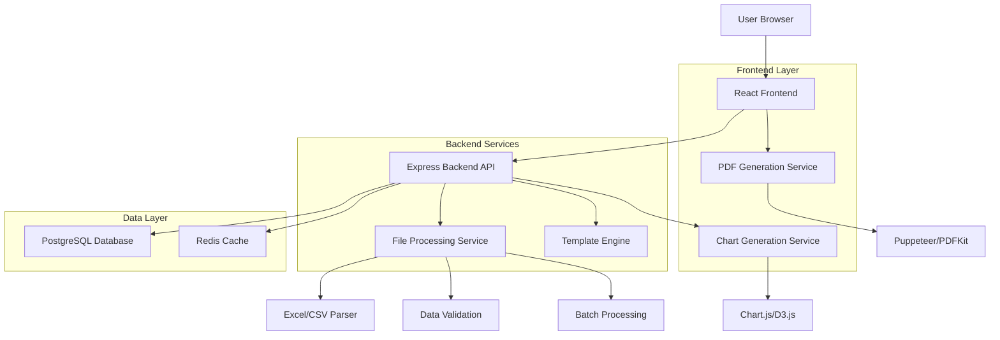
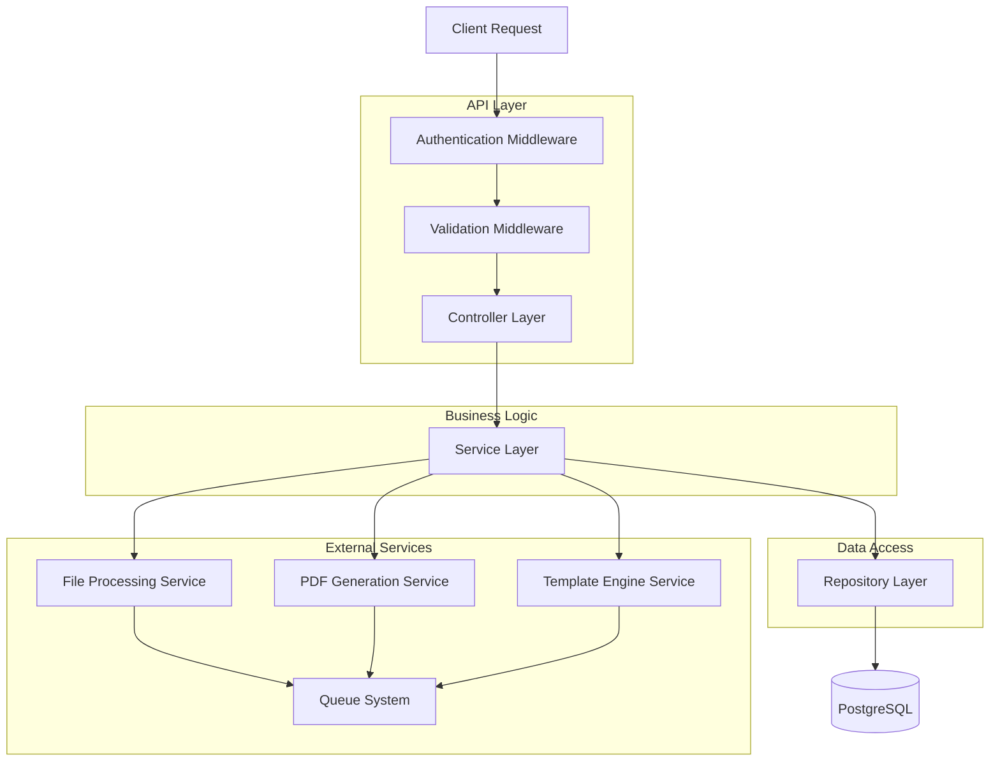
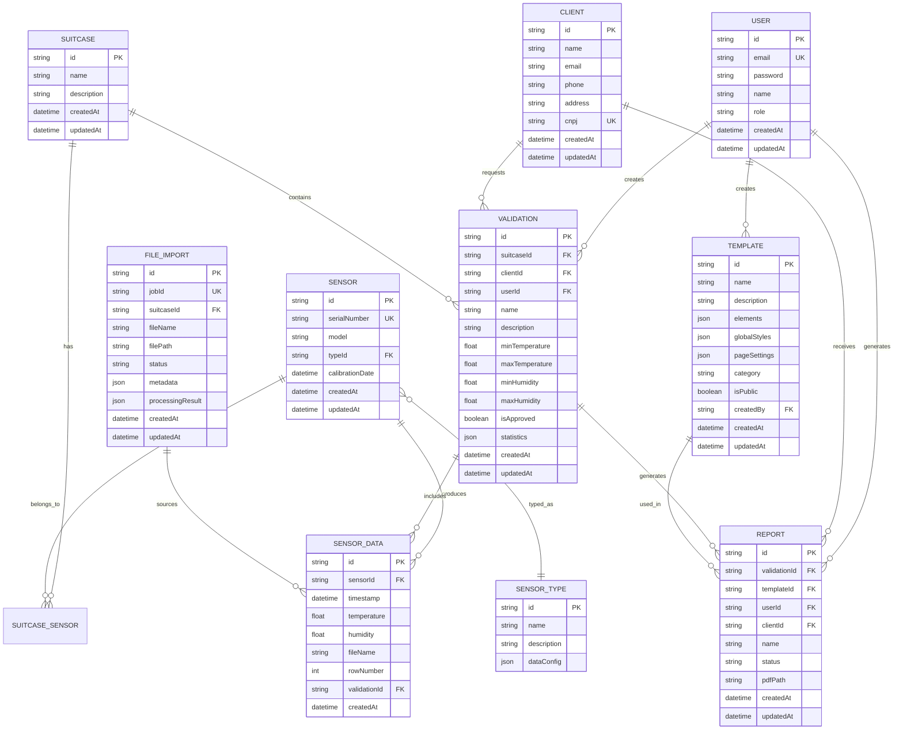
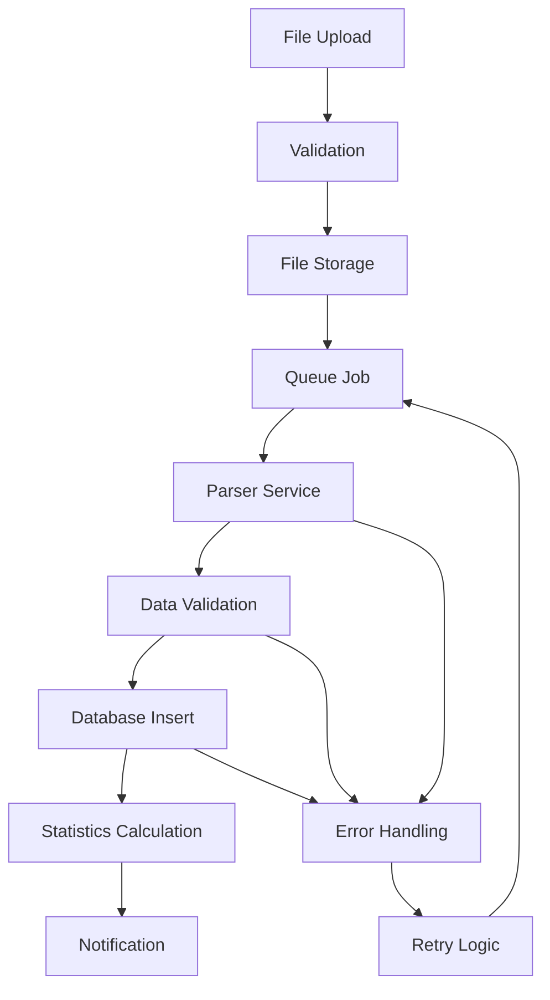

## 1. Architecture Design



## 2. Technology Description

- **Frontend**: React@18 + TypeScript + TailwindCSS@3 + Vite
- **Backend**: Node.js@18 + Express@4 + TypeScript
- **Database**: PostgreSQL@14 (via Docker)
- **Cache**: Redis@7 (via Docker)
- **ORM**: Prisma@5
- **PDF Generation**: Puppeteer + PDFKit
- **Excel Processing**: SheetJS (xlsx)
- **CSV Processing**: PapaParse
- **Charts**: Chart.js + D3.js
- **File Upload**: Multer
- **Authentication**: JWT + bcrypt
- **Template Engine**: Handlebars + React Components
- **Docker**: Docker Compose para desenvolvimento e produção

## 3. Route Definitions

| Route | Purpose |
|-------|---------|
| / | Dashboard principal com estatísticas |
| /login | Página de autenticação de usuários |
| /import | Interface de importação de arquivos |
| /editor | Editor visual de templates |
| /editor/:templateId | Editar template específico |
| /clients | Gerenciamento de clientes |
| /sensors | Gerenciamento de sensores |
| /suitcases | Gerenciamento de maletas |
| /validations | Criação e gestão de validações |
| /reports | Lista e geração de relatórios |
| /templates | Gerenciamento de templates |
| /profile | Perfil do usuário |
| /settings | Configurações do sistema |

## 4. API Definitions

### 4.1 Authentication APIs

```
POST /api/auth/login
```

Request:
```json
{
  "email": "usuario@example.com",
  "password": "senha123"
}
```

Response:
```json
{
  "token": "jwt_token_here",
  "user": {
    "id": "user_id",
    "name": "Nome do Usuário",
    "email": "usuario@example.com",
    "role": "USER"
  }
}
```

### 4.2 File Import APIs

```
POST /api/files/upload
```

Request (multipart/form-data):
- Files: Arquivos XLSX/XLS/CSV
- suitcaseId: ID da maleta
- metadata: JSON com informações adicionais

Response:
```json
{
  "jobId": "processing_job_id",
  "files": [
    {
      "filename": "dados_sensor.xlsx",
      "size": 1024000,
      "status": "processing"
    }
  ]
}
```

### 4.3 Template APIs

```
POST /api/templates
```

Request:
```json
{
  "name": "Template de Laudo Técnico",
  "description": "Template padrão para laudos de validação",
  "elements": [
    {
      "type": "text",
      "content": "{{client_name}}",
      "position": { "x": 100, "y": 200 },
      "style": { "fontSize": 14, "fontFamily": "Arial" }
    }
  ],
  "globalStyles": {
    "pageSize": "A4",
    "orientation": "portrait",
    "margins": { "top": 20, "bottom": 20, "left": 20, "right": 20 }
  }
}
```

### 4.4 Report Generation APIs

```
POST /api/reports/generate
```

Request:
```json
{
  "templateId": "template_id",
  "validationId": "validation_id",
  "clientId": "client_id",
  "name": "Laudo de Validação 001",
  "format": "PDF"
}
```

Response:
```json
{
  "reportId": "report_id",
  "status": "processing",
  "downloadUrl": "/api/reports/download/report_id"
}
```

### 4.5 Data Processing APIs

```
GET /api/validations/:id/statistics
```

Response:
```json
{
  "validationId": "validation_id",
  "statistics": {
    "temperature": {
      "min": 20.5,
      "max": 25.3,
      "average": 22.8,
      "standardDeviation": 1.2
    },
    "humidity": {
      "min": 45.2,
      "max": 78.9,
      "average": 62.1,
      "standardDeviation": 8.5
    },
    "readingsCount": 1440,
    "duration": "24 hours"
  }
}
```

## 5. Server Architecture Diagram



## 6. Data Model

### 6.1 Enhanced Data Model



### 6.2 Data Definition Language

```sql
-- Tabela de usuários (já existe, mantém estrutura atual)

-- Tabela de importações de arquivos
CREATE TABLE file_imports (
    id UUID PRIMARY KEY DEFAULT gen_random_uuid(),
    job_id VARCHAR(100) UNIQUE NOT NULL,
    suitcase_id UUID NOT NULL REFERENCES suitcases(id),
    file_name VARCHAR(255) NOT NULL,
    file_path TEXT NOT NULL,
    status VARCHAR(50) NOT NULL DEFAULT 'pending',
    metadata JSONB,
    processing_result JSONB,
    created_at TIMESTAMP WITH TIME ZONE DEFAULT NOW(),
    updated_at TIMESTAMP WITH TIME ZONE DEFAULT NOW()
);

-- Índices para importações
CREATE INDEX idx_file_imports_job_id ON file_imports(job_id);
CREATE INDEX idx_file_imports_suitcase_id ON file_imports(suitcase_id);
CREATE INDEX idx_file_imports_status ON file_imports(status);
CREATE INDEX idx_file_imports_created_at ON file_imports(created_at DESC);

-- Tabela de templates (extensão da existente)
ALTER TABLE editor_templates ADD COLUMN IF NOT EXISTS elements JSONB;
ALTER TABLE editor_templates ADD COLUMN IF NOT EXISTS global_styles JSONB;
ALTER TABLE editor_templates ADD COLUMN IF NOT EXISTS page_settings JSONB;
ALTER TABLE editor_templates ADD COLUMN IF NOT EXISTS category VARCHAR(50) DEFAULT 'default';
ALTER TABLE editor_templates ADD COLUMN IF NOT EXISTS is_public BOOLEAN DEFAULT false;
ALTER TABLE editor_templates ADD COLUMN IF NOT EXISTS tags TEXT[] DEFAULT '{}';

-- Tabela de relatórios (extensão da existente)
ALTER TABLE reports ADD COLUMN IF NOT EXISTS validation_id UUID REFERENCES validations(id);
ALTER TABLE reports ADD COLUMN IF NOT EXISTS template_id UUID REFERENCES editor_templates(id);

-- Índices adicionais para performance
CREATE INDEX idx_reports_validation_id ON reports(validation_id);
CREATE INDEX idx_reports_template_id ON reports(template_id);
CREATE INDEX idx_reports_status_created ON reports(status, created_at DESC);

-- Permissões básicas para anon e authenticated
GRANT SELECT ON file_imports TO anon;
GRANT ALL PRIVILEGES ON file_imports TO authenticated;
GRANT SELECT ON editor_templates TO anon;
GRANT ALL PRIVILEGES ON editor_templates TO authenticated;
GRANT SELECT ON reports TO anon;
GRANT ALL PRIVILEGES ON reports TO authenticated;

-- Função para atualizar timestamp
CREATE OR REPLACE FUNCTION update_updated_at_column()
RETURNS TRIGGER AS $$
BEGIN
    NEW.updated_at = NOW();
    RETURN NEW;
END;
$$ language 'plpgsql';

-- Trigger para updated_at
CREATE TRIGGER update_file_imports_updated_at 
    BEFORE UPDATE ON file_imports 
    FOR EACH ROW 
    EXECUTE FUNCTION update_updated_at_column();
```

## 7. File Processing Architecture

### 7.1 Excel/CSV Processing Pipeline


### 7.2 Supported File Formats
- **Excel (.xlsx, .xls)**: Suporte para múltiplas planilhas, fórmulas, formatação
- **CSV**: Delimitadores personalizados, codificação UTF-8/ISO-8859-1
- **Formato Esperado**: Colunas de timestamp, temperatura, umidade (opcional), sensor_id (opcional)

### 7.3 Data Validation Rules
- Timestamp válido e em ordem cronológica
- Valores de temperatura dentro de faixa aceitável (-40°C a +85°C)
- Valores de umidade entre 0% e 100%
- Detecção de outliers e dados faltantes
- Validação de consistência temporal

## 8. PDF Generation Architecture

### 8.1 Template Processing
- **Variable Substitution**: {{variable_name}} → Valor real do banco de dados
- **Conditional Rendering**: {{#if condition}} ... {{/if}}
- **Loop Rendering**: {{#each array}} ... {{/each}}
- **Chart Generation**: Gráficos dinâmicos baseados em dados

### 8.2 PDF Output Options
- **Page Size**: A4, A3, Letter, Custom
- **Orientation**: Portrait, Landscape
- **Margins**: Configuráveis (top, bottom, left, right)
- **Header/Footer**: Com numeração de páginas e informações do documento
- **Table of Contents**: Automática com links navegáveis

## 9. Performance Considerations

### 9.1 Database Optimization
- Índices em colunas frequentemente consultadas
- Particionamento de tabelas grandes de dados de sensores
- Materialized views para relatórios complexos
- Connection pooling com PgBouncer

### 9.2 File Processing
- Processamento assíncrono com Bull/Agenda
- Limite de tamanho de arquivo: 50MB por upload
- Chunked processing para arquivos grandes
- Rate limiting para prevenir sobrecarga

### 9.3 Caching Strategy
- Redis para cache de consultas frequentes
- Cache de templates processados
- CDN para assets estáticos
- Browser caching com ETags

## 10. Security Considerations

### 10.1 Authentication & Authorization
- JWT com refresh tokens
- Role-based access control (RBAC)
- API rate limiting por usuário
- CORS configurado adequadamente

### 10.2 Data Protection
- Criptografia de senhas com bcrypt (salt rounds: 12)
- HTTPS obrigatório em produção
- Sanitização de inputs para prevenir SQL injection
- Validação de tipos de arquivo upload

### 10.3 Audit & Compliance
- Audit logging para todas as operações críticas
- Retenção de logs por 90 dias
- Backup automático diário
- Conformidade com LGPD (Lei Geral de Proteção de Dados)