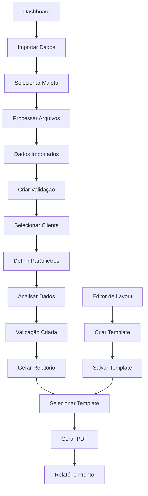

## 1. Product Overview
Sistema completo para importação de dados de sensores de temperatura e umidade, com editor visual de layouts para geração de laudos técnicos personalizáveis. Permite importar múltiplos arquivos Excel/CSV, gerenciar clientes, sensores e maletas, criar templates profissionais com elementos dinâmicos e exportar relatórios em PDF.

O sistema atende empresas de calibração e validação de equipamentos que precisam gerar laudos técnicos padronizados e personalizados com dados de monitoramento ambiental.

## 2. Core Features

### 2.1 User Roles
| Role | Registration Method | Core Permissions |
|------|---------------------|------------------|
| Usuário Comum | Cadastro por administrador | Importar dados, criar templates, gerar relatórios |
| Administrador | Cadastro inicial | Acesso total ao sistema, gerenciar usuários e configurações |

### 2.2 Feature Module
O sistema de importação e geração de relatórios consiste nas seguintes páginas principais:

1. **Dashboard**: Visão geral do sistema, estatísticas de importações e relatórios gerados
2. **Importar Dados**: Upload de arquivos XLS/XLSX/CSV, visualização de dados, associação a maletas
3. **Editor de Layout**: Interface visual para criar templates com textos, imagens, tabelas, gráficos, cabeçalho e rodapé
4. **Clientes**: Cadastro e gerenciamento de clientes para os laudos
5. **Sensores**: Gerenciamento de sensores e tipos de sensores
6. **Maletas**: Gerenciamento de maletas e associação de sensores
7. **Validações**: Criação de validações com parâmetros de temperatura e umidade
8. **Relatórios**: Geração e visualização de laudos em PDF
9. **Templates**: Gerenciamento de templates de layout

### 2.3 Page Details
| Page Name | Module Name | Feature description |
|-----------|-------------|---------------------|
| Dashboard | Estatísticas | Visualizar total de importações, relatórios gerados, clientes ativos e gráficos de tendências |
| Dashboard | Atividades Recentes | Listar últimas importações, validações e relatórios gerados com status e timestamps |
| Importar Dados | Upload de Arquivos | Arrastar e soltar ou selecionar múltiplos arquivos XLS/XLSX/CSV com validação de formato |
| Importar Dados | Visualização de Dados | Exibir preview dos dados importados em tabela com mapeamento de colunas |
| Importar Dados | Associação a Maleta | Selecionar maleta para associar os dados importados dos sensores |
| Importar Dados | Processamento | Processar arquivos em background com barra de progresso e notificações |
| Editor de Layout | Canvas Visual | Interface drag-and-drop para posicionar elementos na página com grade de snap |
| Editor de Layout | Elementos | Adicionar e configurar textos, imagens, tabelas, gráficos, cabeçalho, rodapé e variáveis |
| Editor de Layout | Propriedades | Painel lateral para editar propriedades dos elementos selecionados (tamanho, cor, fonte, alinhamento) |
| Editor de Layout | Templates | Salvar, carregar e gerenciar templates com versionamento e categorias |
| Editor de Layout | Preview | Visualizar layout em tempo real com dados reais antes de exportar |
| Clientes | Lista de Clientes | Tabela paginada com busca, filtros e ordenação de clientes cadastrados |
| Clientes | Cadastro/Edição | Formulário com campos de nome, email, telefone, endereço completo e CNPJ |
| Clientes | Importação em Lote | Upload de arquivo CSV para cadastrar múltiplos clientes simultaneamente |
| Sensores | Lista de Sensores | Visualizar sensores cadastrados com número de série, modelo e tipo |
| Sensores | Cadastro/Edição | Formulário para cadastrar sensor com número de série único, modelo e tipo |
| Sensores | Tipos de Sensores | Gerenciar tipos de sensores com configurações de dados (temperatura, umidade, etc) |
| Maletas | Lista de Maletas | Visualizar maletas com quantidade de sensores associados |
| Maletas | Cadastro/Edição | Formulário para criar/editar maletas com nome e descrição |
| Maletas | Associar Sensores | Interface para vincular/desvincular sensores à maleta com posicionamento |
| Validações | Lista de Validações | Visualizar validações criadas com status de aprovação e parâmetros |
| Validações | Criar Validação | Selecionar cliente, maleta e definir parâmetros de temperatura e umidade |
| Validações | Análise de Dados | Sistema calcula estatísticas automáticas dos dados importados (média, mínima, máxima, desvio padrão) |
| Validações | Aprovação/Rejeição | Marcar validação como aprovada ou reprovada baseada nos parâmetros definidos |
| Relatórios | Lista de Relatórios | Visualizar relatórios gerados com status, cliente e data de criação |
| Relatórios | Gerar PDF | Selecionar template, validation e gerar PDF com dados dinâmicos |
| Relatórios | Download/Visualização | Fazer download ou visualizar PDF gerado no navegador |
| Templates | Gerenciamento | Listar, criar, editar e excluir templates de layout com categorias |
| Templates | Importação/Exportação | Compartilhar templates entre instalações do sistema |

## 3. Core Process

### Fluxo Principal de Importação e Geração de Relatórios

1. **Importação de Dados**: Usuário faz upload de arquivos XLS/XLSX/CSV → Sistema valida e processa dados → Dados são associados a sensores específicos de uma maleta
2. **Criação de Template**: Usuário acessa editor visual → Arrasta elementos para o canvas → Configura propriedades e variáveis → Salva template
3. **Geração de Validação**: Seleciona cliente e maleta → Define parâmetros de temperatura/umidade → Sistema analisa dados importados → Gera estatísticas
4. **Geração de Relatório**: Seleciona template e validação → Sistema substitui variáveis por dados reais → Gera PDF com layout personalizado

## 4. User Interface Design

### 4.1 Design Style
- **Cores Primárias**: Azul profissional (#1e40af) para elementos principais
- **Cores Secundárias**: Cinza claro (#f3f4f6) para fundos e bordas
- **Botões**: Estilo arredondado com sombra suave, hover com transição suave
- **Fontes**: Inter para textos principais, fonte monoespaçada para dados técnicos
- **Layout**: Card-based com navegação lateral, responsivo para desktop primeiro
- **Ícones**: Lucide React com consistência de espessura e estilo

### 4.2 Page Design Overview
| Page Name | Module Name | UI Elements |
|-----------|-------------|-------------|
| Dashboard | Cards de Estatísticas | Cards com ícones, números grandes, gráficos de barras/linhas simples, cores baseadas em status |
| Importar Dados | Área de Upload | Zona de drag-and-drop destacada, lista de arquivos com preview, botão de upload primário |
| Editor de Layout | Canvas Central | Área branca com grid de fundo, elementos destacados ao selecionar, handles de redimensionamento |
| Editor de Layout | Paleta de Elementos | Sidebar com ícones de elementos, drag visual ao arrastar para o canvas |
| Clientes | Tabela Responsiva | Tabela com linhas alternadas, botões de ação compactos, paginação no rodapé |
| Relatórios | Lista de Cards | Cards horizontais com thumbnail do PDF, status colorido, botões de ação |

### 4.3 Responsiveness
- **Desktop-first**: Otimizado para telas grandes (1920x1080) com uso eficiente do espaço
- **Mobile-adaptive**: Layout adaptativo para tablets e smartphones com menu hambúrguer
- **Touch optimization**: Botões e áreas de toque com mínimo 44px para interação móvel
- **Breakpoints**: 640px (mobile), 768px (tablet), 1024px (desktop), 1280px (wide)