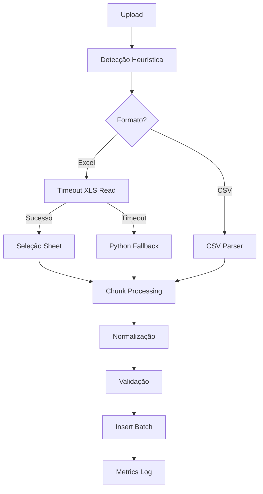

# Sistema de Importação de Sensores - Guia para Desenvolvedores

## Visão Geral

O sistema de importação foi projetado para processar arquivos de múltiplos fabricantes de dataloggers (Elitech, Novus, Instrutemp, Testo, etc.) sem necessidade de conversão manual. Suporta formatos `.xls`, `.xlsx` e `.csv`.

## Arquitetura

### Componentes Principais

1. **Heurísticas de Detecção** (`backend/src/parsers/heuristics.ts`)
   - Detecta formato (Excel/CSV/texto) por extensão e conteúdo
   - Identifica fornecedor por nome do arquivo e headers
   - Retorna score de confiança e vendor guess

2. **Normalização** (`backend/src/utils/normalizationUtils.ts`)
   - Conversão de números com vírgula/ponto decimal
   - Parsing flexível de datas (dd/MM/YYYY, YYYY-MM-DD, ISO8601)
   - Validação de faixas (temperatura: -80 a 120°C, umidade: 0-100%)

3. **Processamento com Timeout** (`backend/src/services/excelProcessingService.ts`)
   - Timeout configurável via `XLS_READ_TIMEOUT_MS` (padrão 10s)
   - Detecção automática de planilha por vendor (Elitech: "Lista", Novus: "Dados", etc.)
   - Processamento incremental em chunks

4. **Fallback Python** (`backend/src/services/pythonFallbackService.ts`)
   - Acionado automaticamente quando Node falha em arquivos `.xls` legados
   - Usa pandas + xlrd para leitura robusta
   - Insere dados em batches durante streaming

5. **Métricas** (`backend/src/services/processingMetricsService.ts`)
   - Tempo por etapa (workbook_load, chunk_processing, total_processing)
   - Contadores (rows_processed, rows_failed)
   - Logs estruturados com percentuais

### Interface de Plugins

```typescript
interface FileParser {
  name: string;
  detect(meta: FileMeta, sample?: Buffer): boolean | Promise<boolean>;
  parse(meta: FileMeta, options: any): AsyncGenerator<NormalizedRow>;
  normalize?(raw: any, context: any): NormalizedRow;
}
```

**Registro:**
```typescript
import { parserRegistry } from './parsers/fileParser';
parserRegistry.register(myCustomParser);
```

## Adicionando Novo Fornecedor

### 1. Atualizar Heurísticas

Edite `backend/src/parsers/heuristics.ts`:

```typescript
const vendorMap: Record<string,string> = {
  elitech: 'Elitech',
  novus: 'Novus',
  instrutemp: 'Instrutemp',
  testo: 'Testo',
  meuvendor: 'MeuVendor'  // Adicione aqui
};
```

### 2. Definir Preferências de Planilha

Edite `backend/src/services/excelProcessingService.ts`:

```typescript
case 'MeuVendor':
  for (const candidate of ['Logs', 'Medidas', 'Data']) {
    if (workbook.SheetNames.includes(candidate)) { 
      sheetName = candidate; 
      break; 
    }
  }
  break;
```

### 3. Criar Parser Específico (Opcional)

Para formatos muito específicos:

```typescript
// backend/src/parsers/meuVendorParser.ts
export const meuVendorParser: FileParser = {
  name: 'MeuVendor',
  detect(meta) {
    return /meuvendor/i.test(meta.fileName);
  },
  async *parse(meta, options) {
    // Lógica customizada
    yield {
      sensorSerial: 'ABC123',
      timestamp: new Date(),
      temperatureC: 25.5,
      humidityPct: 60
    };
  }
};

parserRegistry.register(meuVendorParser);
```

## Configuração

### Variáveis de Ambiente

```env
# Timeout de leitura XLS (ms)
XLS_READ_TIMEOUT_MS=10000

# Fallback Python
PYTHON_FALLBACK_BIN=python3
PYTHON_FALLBACK_SCRIPT=backend/python/fallback_parser.py
PYTHON_FALLBACK_TIMEOUT_MS=20000

# Modo de fallback
FALLBACK_MODE=python
```

## Fluxo de Processamento



## Logs e Depuração

Buscar no log do backend:

```bash
# Heurísticas
docker logs backend | grep "Heuristic detection"

# Sheet selecionada
docker logs backend | grep "Selected sheet"

# Métricas
docker logs backend | grep "Processing metrics summary"

# Fallback Python
docker logs backend | grep "Python fallback"
```

## Testes

### Teste Manual

```powershell
# Rebuild
docker-compose -f docker-compose.prod.yml build backend
docker-compose -f docker-compose.prod.yml up -d backend

# Enviar arquivo
curl -X POST http://localhost:3001/api/files/upload \
  -H "Authorization: Bearer $TOKEN" \
  -F "files=@sensor.xls" \
  -F "suitcaseId=123"

# Verificar status
curl http://localhost:3001/api/files/status/$JOB_ID

# Consultar dados
docker-compose exec postgres psql -U laudo_user -d laudo_db \
  -c "SELECT COUNT(*) FROM sensor_data;"
```

### Teste Automatizado (Futuro)

Criar em `backend/tests/parsers/`:

```typescript
describe('VendorParser', () => {
  it('deve detectar arquivo MeuVendor', () => {
    const meta = { fileName: 'meuvendor_001.xls', ... };
    expect(meuVendorParser.detect(meta)).toBe(true);
  });
});
```

## Troubleshooting

### Arquivo não processa

1. Verificar logs de heurística → vendor detectado?
2. Verificar timeout → ajustar `XLS_READ_TIMEOUT_MS`
3. Tentar Python fallback manualmente:
   ```bash
   python backend/python/fallback_parser.py arquivo.xls
   ```

### Dados errados

1. Verificar normalização de número (vírgula vs ponto)
2. Verificar formato de data (day-first vs month-first)
3. Adicionar logs em `normalizationUtils.ts`

### Performance

1. Consultar métricas: `processingMetricsService.getAllMetrics()`
2. Ajustar `chunkSize` (padrão 1000 linhas)
3. Considerar workers (BullMQ) para grandes volumes

## Roadmap

- [ ] Workers assíncronos (BullMQ)
- [ ] Persistência incremental com retomada
- [ ] Testes automatizados por vendor
- [ ] Dashboard Grafana/Prometheus
- [ ] API REST para métricas (`/api/metrics/parsing`)

## Contribuindo

1. Adicione samples em `backend/tests/fixtures/`
2. Documente estrutura do arquivo
3. Crie heurísticas específicas
4. Adicione testes unitários
5. Atualize este README

---

**Contato:** Abra issue no repositório ou consulte equipe de desenvolvimento.
